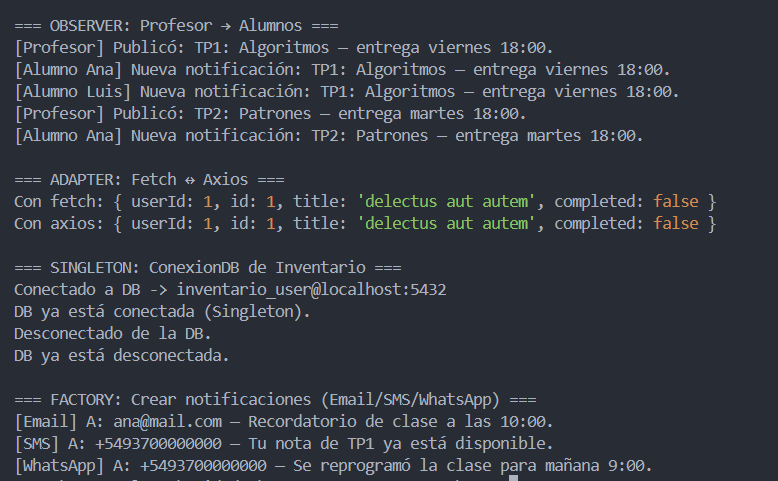

# Actividad Práctica: Patrones de Diseño en TypeScript

**Objetivo general:** implementar cuatro patrones con casos simples y modulares.  
El proyecto ya está organizado en carpetas y se ejecuta desde un único `src/app.ts`.

---

## Observer (Profesor → Alumnos)

- Caso: un profesor publica tareas y los alumnos suscriptos reciben la notificación.
- Interfaces: `IPublisher` (subscribe/unsubscribe/publish) e `ISubscriber` (update).
- Clases: `Professor` y `Student`.
- Ejecución: publicar dos tareas; dar de baja a un alumno entre publicaciones.

---

## Adapter (Fetch ↔ Axios)

- Caso: cliente HTTP intercambiable para consultar JSONPlaceholder.
- Interfaz: `IHttpClient` con método `get<T>(url)`.
- Adapters: `FetchAdapter` y `AxiosAdapter`.
- Cliente: `SimpleHttpClient` permite cambiar el adapter en caliente.

---

## Singleton (ConexionDB de Inventario)

- **Objetivo:** Utilizar el patrón Singleton para manejar la conexión a la base de datos de inventario.
- Crear una clase `ConexionDB` que siga el patrón Singleton.
- Esta clase debe manejar la conexión a una base de datos ficticia, con propiedades como host, puerto y usuario.
- Implementar métodos para conectar y desconectar la base de datos.
- Garantizar que todas las partes de la aplicación utilicen la misma instancia de `ConexionDB`.

---

## Factory (Notificaciones Email/SMS/WhatsApp)

- Caso: crear notificaciones de distintos canales sin cambiar el código cliente.
- Interfaz: `INotifier` con método `send(to, message)`.
- Factory: `NotifierFactory.create(channel)` soporta `"email"`, `"sms"` y `"whatsapp"`.
- Actividad: agregar validaciones de formato para cada canal (opcional).

---

## Requisitos de código

- Código modular: carpeta por patrón; dentro `index.ts`, `clases/` e `interfaces/`.
- Tipado estricto y correcto en interfaces y clases.
- Indentación clara y nombres descriptivos.
- Un solo punto de entrada `src/app.ts` para ejecutar todos o cada caso por separado.

---

## Estructura esperada

```
src/
  app.ts
  adapter/
    index.ts
    clases/
      AxiosAdapter.ts
      FetchAdapter.ts
      SimpleHttpClient.ts
    interfaces/
      IHttpClient.ts
  observer/
    index.ts
    clases/
      Professor.ts
      Student.ts
    interfaces/
      IPublisher.ts
      ISubscriber.ts
  singleton/
    index.ts
    clases/
      ConexionDB.ts
    interfaces/
      IConexionDB.ts
  factory/
    index.ts
    clases/
      EmailNotifier.ts
      SmsNotifier.ts
      WhatsappNotifier.ts
      NotifierFactory.ts
    interfaces/
      INotifier.ts
      channel.ts
```

## Salida Final de ejemplo (Pueden cambiar los datos)



## Scripts para inicializar el proyecto

```bash
npm i
npm dev
```
